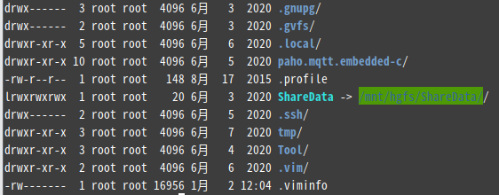

# 用户与用户组

Linux里任何文件都具有用户、用户组和其他人三种身份的个别权限。

注：

1、在Linux系统当中，默认情况下，所以的系统上的账号与一般身份用户，还有超级用户root的相关信息记录在/etc/passwd文件中；

2、个人密码记录在/etc/shadow文件中；

3、Linux所有的组名记录在/etc/group中。

# Linux文件属性

图中，各列元素依次描述了文件类型权限、链接数、文件拥有者、文件所属用户组、文件大小、文件最后修改时间、以及文件名称。下边列出几个类别的详情。

**文件类型权限**

观察可知文件权限由10个字符构成。

第一个字符代表的该文件是目录、文件或者链接文件。

[d]表示目录，[l]表示链接文件，[-]表示文件，[b]表示为设备文件里面的可供存储的周边设备（可按块随机读写的设备），[c]则表示为设备文件里面的串行端口设备，例如键盘、鼠标(一次性读取设备)；

**以后**每三个字符为一组，均为[rwx]的三个参数的组合。其中[r]代表可读、[w]代表可写、[x]代表可执行。分别代表了文件拥有者、加入此用户组的账户、非本人且没有加入本用户组的其他账户的权限。

**链接数**

代表有多少文件名链接到此节点。

